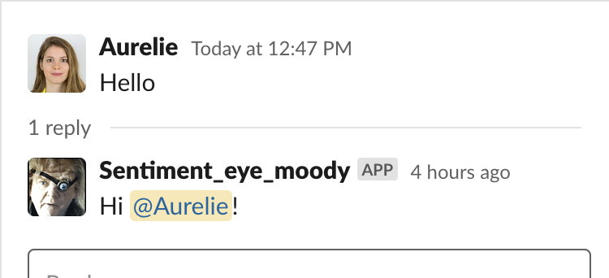

### Docker Compose project with sentiment analysis 

People speak online, and in the Agile community, we help each other a lot on slack channels. I wanted to analyse the positivity or negativity of posts in the general slack channel of different agile slack workplaces by assigning them sentiment scores. 
Then, I build a slack bot that is able to listen to all messages posted in the channels it has access to, and answers when someone says hi (it’s a polite chatbot of course!) and when someone wants to hear something positive or negative that has been said in the online agile community.

This was done by building a data pipeline, consisting of 5 different docker containers:
1) The first slack bot to collect data
2) A Mongodb to host the raw data
3) A python module that extracts the data from the mongoldb, performs sentiment analysis, and loads the transformed data to a Postgres db. 
4) A Postgres db to hold the analysed data
5) The second chat bot which listens to messages and answers users on certain prompts

 

### Usage 
The usage is complicated because you will need to create 1 or 2 slack apps. Make sure you have [Docker](https://docs.docker.com/get-docker/) installed.

#### Step 1
Create a virtual environement with python 3.8 (optional): conda create -n py38 python=3.8 
Activate the virtual environment (optional): conda activate py38

#### Step 2
Clone the repository

#### Step 3
This first step is optional. If you want to work with the data I collected, jump to step 4. But if you want to collect your own data, please follow the instructions.
- Decide on which slack workplace you want to collect the messages (ask the admin and be sure it is ok to do this)
- Go to the [slack api](https://api.slack.com/apps) and click the Create a new Classic App button 
- Under ‘ Add features and functionality’  > Bots > Review Scopes to add > Scopes : add both channels:history and channels:read
- On the top of the page, click add to workspace then allow it (you might need to wait for the admin of the slack channel to allow it) 
- Copy the oath token generated and paste it in the file 1_slack_collector/slack_messages.py
- Uncomment line 70 to 73 and comment out line 76 to 77
- Open your slack app and and add this bot to your general channel (simply mention the @{your_slack_bot_name}  and click invite to channel 

#### Step 4
- Decide on which workspace you want to have your end slack app, it can be the same as for the first app or a complete different workspace. 
- Go to the [slack api](https://api.slack.com/apps?new_classic_app=1) and click the Create a new Classic App (careful this is not the same type of app as in step 3)
- Under ‘ Add features and functionality’  > Bots > Add Legacy Bot User > type in the name of your app 
- Under Settings > OAuth & Permissions > Scopes > add channels:read
DO NOT UPDATE THE SCOPES! 
- In settings > Install app > Install app to workspace 
- In Features > OAuth & Permissions > Bot User OAuth Access Token : copy the token and paste it in the file 5_slack_bot/slack_bot.py
- Open your slack app and and add this bot to any channel you want it it listen to (simply mention the @{your_slack_bot_name}  and click invite to channel

#### Step 5
Time to run it! 
- In your terminal, run: docker-compose build 
- docker-compose up 

You should now be able to interact with a slack bot in the channel you chose in step 4. Type in ‘Hello’, or ‘say something positive’, and check out the answer of your bot! 

Note: this is a demo project, so I deliberately chose to keep the password of the db so you can have a look into it even if you do not install the slack apps. Just ignore step 3 and 4 and access the databases from your terminal (docker exec -it mongodb mongo / docker exec -it ps_name bash) 
And regarding the oath tokens, they do not need to be hidden because you would need access to the slack channels and ask for the admins’ approval to install the app on their slack. 

